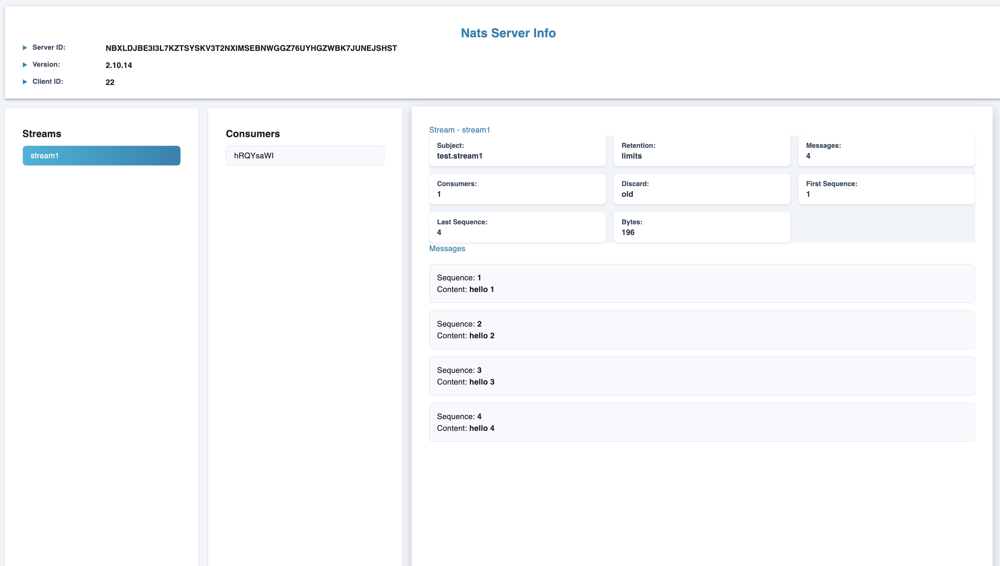

# NATS UI for JetStream

## Overview
NATS UI for JetStream is a real-time web dashboard built using React for monitoring and managing message streaming in **NATS JetStream**. The dashboard provides detailed insights into the system, including the number of messages, stream and consumer information, and more. It allows users to view, manage, and delete messages while visualizing the data in pie charts and tables.

### Key Features:
- **Message Metrics**: Displays the total number of messages in the system, including processed and unprocessed messages.
- **Interactive Tables**: Provides a detailed view of each message with options to:
  - View sequence number.
  - Delete messages.
  - See server, stream, and consumer details.
- **Real-time Updates**: Updated data for active monitoring of the NATS JetStream system.

## Technologies Used:
- **React**: Frontend for building the user interface.
- **Docker**: Containerized application to make deployment easier and more scalable.
- **NATS JetStream**: Message streaming platform for real-time data and messaging.
- **Docker Compose**: For managing the multi-container setup of the frontend and backend services.

---
## Screenshot

Below is a screenshot of the **NATS UI for JetStream** web app:

 

---
## How to Run Locally

To run this project locally, follow the steps below:

### Prerequisites:
- **Docker**: Ensure Docker and Docker Compose are installed on your system. You can download and install Docker from [here](https://www.docker.com/get-started).
- **Node.js and npm**: For building and running the React app locally (if you want to work directly on the frontend code).

### Steps to Run Locally:

1. Clone the repository to your local machine:
   ```bash
   git clone https://github.com/yourusername/nats-ui.git
   cd nats-ui

2. Build and start the services using Docker Compose:

```bash
docker-compose up --build
```

3. Once the containers are up and running, you can access the app in your browser:

- **Frontend**: [http://localhost:3000](http://localhost:3000)
- **Backend**: [http://localhost:8010](http://localhost:8010)

## Environmental Variables:

Make sure to create an `.env.frontend` file in the project root and include the following environment variable for your frontend setup:
```
VITE_APP_SERVER_URL=http://localhost:8010
This URL points to the backend service running locally at port `8010`.
```

### TODO

- Implement automatic reloading of FastAPI to detect when NATS connects, disconnects, and reconnects.
  

## Contributing

Feel free to contribute to this project! Whether it's reporting bugs, submitting issues, or creating pull requests, contributions are always welcome. Here's how you can contribute:

1. Fork the repository.
2. Create a new branch for your feature or bug fix.
3. Make your changes and test them.
4. Submit a pull request.

We appreciate your contributions!


